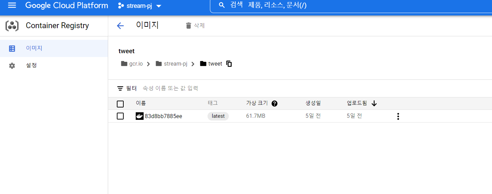

# Streaming data-pipeline in GCP

## 0. 준비

#### 1) gcloud CLI 설치

https://cloud.google.com/sdk/docs/install?hl=ko

#### 2) 서비스 계정 만들기

https://cloud.google.com/iam/docs/creating-managing-service-account-keys#creating_service_account_keys

- pub/sub 편집, BigQuery 편집 권한 부여


- 권한 확인


## 1. 프로젝트 개요

 

##### - 트위터에서 스트리밍 데이터를 받아 빅쿼리에 DW를 구축하고 시각화 해본다.

##### - 도커 이미지를 Container Registry에 저장하고 쿠버네티스를 통해 배포해본다.


### 2. Twitter Streaming Data

#### 1) tweepy

https://docs.tweepy.org/ko/v3.9.0/getting_started.html

#### 2) twitter developer

https://developer.twitter.com/en

 


- developer를 통해 project와 key를 생성하고 tweepy API를 통해 트위터의 메세지를 실시간으로 수집
- bitcoin tag로 검색된 트윗 수집


### 3. Google cloud pub/sub

- 완전관리형 실시간 메시징 서비스
- 데이터를 수집하고 배포하는 스트리밍 분석 및 데이터 통합 파이프라인에 사용됨

##### 1) pub 만들기


##### 2) sub 만들어 구독하기


 


- 메시지 확인 

-  

   

### 4. Google cloud Functions

- 서비리스 제품, function 단위로 서버없이 사용가능
- 트리거 조건과 코드를 설정해놓으면, 원하는 동작을 자동으로 수행
- publish에 tweet이 들어왔을때 모아서 bigQuery로 넣는다.

##### 1) 트리거 등록

​	


##### 2) 함수 만들기

​	


### 5. BigQuery 

- 완전관리형 SQL데이터웨어하우스 

- 매우큰데이터도매우저렴하게저장,빠른속도로처리가능

##### 1) 미리보기


##### 2) 데이터 갯수 세기


### 6. DataStudio

- 다양한 소스를 연결할 수 있는 대시보드 서비스

##### 1) BigQuery와 연결


##### 2) 가장 많이 RT된 데이터, 시간 별 Record 갯수


### 7. Google kubernetes Engine in Ubuntu

-  컨테이너를 쉽고 빠르게 배포/확장하고 관리를 자동화해주는 오픈소스 플랫폼

##### 1) gcloud CLI를 설치하고 Container Registry에 접근할 수 있는 서비스 계정 생성

​	https://cloud.google.com/container-registry/docs/advanced-authentication#gcloud-helper

##### 2) 서비스 계정 사용자 인증 정보로 인증을 구성

​	https://cloud.google.com/container-registry/docs/advanced-authentication#gcloud-helper

##### 3) docker file을 만들고 build

```bash
docker build -t tweet .

gcloud auth configure-docker

docker push gcr.io/[project_name]/tweet
```


##### - Container Registry



##### - kubernetes 


